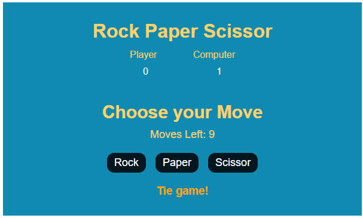
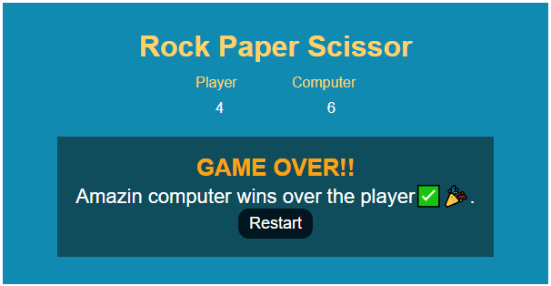
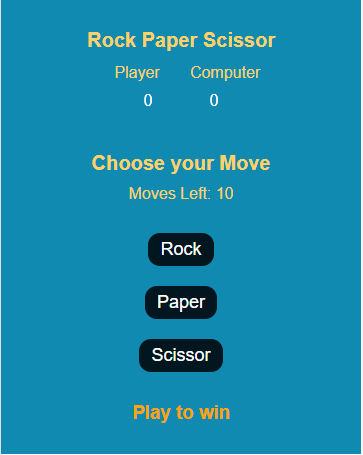

# This is a simple rock paper scissor game built using HTML, CSS, and Javacript.

# In this project i learned the following;
    # How  to handle event handler.
        # getting data from the DOM and
        update the DOM based on certain requirement.

    # How to use querySelector.
    # I learned and practice how to handle different data types.

        # Like when you get a data from the DOM, if it is a number, the type will be a string.
        I practice how to convert it to a number so i can work with it accordingly.

    # I strengthen my function knowledge and practice the dry principles

    #I also used media query to make the simple app responsive.
